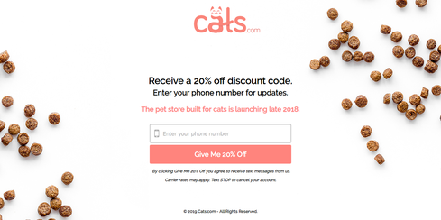
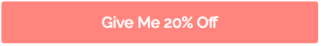

# Cats.com/ Assessment

__<https://cats.com/>__

__Screenshot:__



<div id="toc">
<!--TOC-->
</div>

<br>
<hr>

# Accessibility

These checks highlight opportunities to [improve the accessibility of your web app](https://developers.google.com/web/fundamentals/accessibility). Only a subset of accessibility issues can be automatically detected so manual testing is also encouraged.

These items address areas which an automated testing tool cannot cover. Learn more in our guide on [conducting an accessibility review](https://developers.google.com/web/fundamentals/accessibility/how-to-review).


## Form elements do not have associated labels [WCAG 3.3.2](https://www.w3.org/WAI/WCAG21/quickref/?versions=2.0#labels-or-instructions)

Labels ensure that form controls are announced properly by assistive technologies, like screen readers. [Learn more](https://dequeuniversity.com/rules/axe/3.1/label?application=lighthouse).


### This element is missing a label

__Visual location:__


__HTML location:__

```html
<input id="phone" name="phone" type="tel" placeholder="Enter your phone number" autocomplete="off" required="required">
```

#### Suggested solution:
Add `<label for="something">` to associate the label with that form field. If the form element does not have an ID attribute to associate add `id="something"`.
If you wish to visually hide the label then add a class like `.sr-only` or `.element-invisible` to the `<label>`.

If that already exists, add a `placeholder` attribute. Hidden labels require a `placeholder` attribute so people know what the field is for.

<details>
<summary>_Other options:_</summary>
Fix any of the following:
<br>aria-label attribute does not exist or is empty
<br>aria-labelledby attribute does not exist, references elements that do not exist or references elements that are empty
<br>Form element does not have an implicit (wrapped) &lt;label&gt;
<br>Form element does not have an explicit &lt;label&gt;
<br>Element has no title attribute or the title attribute is empty
</details>

<details>
<summary>_Additional debugging details_</summary>
Path:<br>
`1,HTML,1,BODY,1,SECTION,0,DIV,1,DIV,0,FORM,1,DIV,0,INPUT`<br>
Selector:<br>
`#phone`
</details>

---


## Background and foreground colors do not have a sufficient contrast ratio. [WCAG 1.4.3](https://www.w3.org/WAI/WCAG21/quickref/?versions=2.0#contrast-minimum)

Low-contrast text is difficult or impossible for many users to read. [Learn more](https://dequeuniversity.com/rules/axe/3.1/color-contrast?application=lighthouse).


### The element _"Give Me 20% Off"_ has low contrast.

__Visual location:__




__HTML location:__

```html
<button id="notify_me" type="submit">Give Me 20% Off</button>
```

#### Suggested solution:

  Element has insufficient color contrast of 2.37 (foreground color: #ffffff, background color: #ff847d, font size: 16.5pt, font weight: normal). Expected contrast ratio of 4.5:1

[Find a color with higher contrast](http://contrast-finder.tanaguru.com).

<details>
<summary>_Additional debugging details_</summary>
Path:<br>
`1,HTML,1,BODY,1,SECTION,0,DIV,1,DIV,0,FORM,2,BUTTON`<br>
Selector:<br>
`#notify_me`
</details>

---


## `[user-scalable="no"]` is used in the `<meta name="viewport">` element or the `[maximum-scale]` attribute is less than 5. [WCAG 1.4.4](https://www.w3.org/WAI/WCAG21/quickref/?versions=2.0#resize-text)

Disabling zooming is problematic for users with low vision who rely on screen magnification to properly see the contents of a web page. [Learn more](https://dequeuniversity.com/rules/axe/3.1/meta-viewport?application=lighthouse).


### This `<meta>` tag has attributes that are detrimental to accessibility.

__HTML location:__

```html
<meta name="viewport" content="width=device-width,initial-scale=1,maximum-scale=1">
```

#### Suggested solution:

If applicable:

1. Change `maximum-scale=1.0` to at least `maximum-scale=5`.

2. Remove the `user-scaleable=no` attribute from the meta tag.

<details>
<summary>_Other options:_</summary>
Fix any of the following:
<br>maximum-scale on &lt;meta&gt; tag disables zooming on mobile devices
</details>

<details>
<summary>_Additional debugging details_</summary>
Path:<br>
`1,HTML,0,HEAD,1,META`<br>
Selector:<br>
`meta[name="viewport"]`
</details>

---


## `[accesskey]` values are unique [WCAG 2.1](https://www.w3.org/WAI/WCAG21/quickref/#keyboard-accessible)

__I need a human!__ Manual Test: `[accesskey]` values are unique

Description:<br>
Access keys let users quickly focus a part of the page. For proper navigation, each access key must be unique. [Learn more](https://dequeuniversity.com/rules/axe/3.1/accesskeys?application=lighthouse).

Using the `accesskey` attribute is discouraged because they can interfere with assistive technology. On most websites they are not necessary or helpful. If they do exist, they must be unique.

---


## The page has a logical tab order [WCAG 2.4.3](https://www.w3.org/WAI/WCAG21/quickref/?versions=2.0#focus-order)

__I need a human!__ Manual Test: The page has a logical tab order

Description:<br>
Tabbing through the page follows the visual layout. Users cannot focus elements that are offscreen. [Learn more](https://developers.google.com/web/fundamentals/accessibility/how-to-review#start_with_the_keyboard).

---


## Interactive controls are keyboard focusable [WCAG 2.1.1](https://www.w3.org/WAI/WCAG21/quickref/?versions=2.0#keyboard)

__I need a human!__ Manual Test: Interactive controls are keyboard focusable

Description:<br>
Custom interactive controls are keyboard focusable and display a focus indicator. [Learn more](https://developers.google.com/web/fundamentals/accessibility/how-to-review#start_with_the_keyboard).

Pay special attention to menus. The user should be able access the entire menu with the keyboard alone.

---


## Interactive elements indicate their purpose and state  [WCAG 1.4.1](https://www.w3.org/WAI/WCAG21/quickref/#use-of-color) [WCAG 1.3.3](https://www.w3.org/WAI/WCAG21/quickref/#sensory-characteristics)


__I need a human!__ Manual Test: Interactive elements indicate their purpose and state

Description:<br>
Interactive elements, such as links and buttons, should indicate their state and be distinguishable from non-interactive elements. [Learn more](https://developers.google.com/web/fundamentals/accessibility/how-to-review#interactive_elements_like_links_and_buttons_should_indicate_their_purpose_and_state).

Pay special attention to buttons and links.  For example, links and buttons should have obvious :hover and :focus states that meet WCAG 2.0 AA contrast requirements.

---


## The user's focus is directed to new content added to the page [WCAG 3.2.2](https://www.w3.org/WAI/WCAG21/quickref/?versions=2.0#on-input)

__I need a human!__ Manual Test: The user&#39;s focus is directed to new content added to the page

Description:<br>
If new content, such as a dialog, is added to the page, the user&#39;s focus is directed to it. [Learn more](https://developers.google.com/web/fundamentals/accessibility/how-to-review#start_with_the_keyboard).

Pay special attention to popup windows like ads or email signup solicitations. 

---


## User focus is not accidentally trapped in a region [WCAG 2.1.2](https://www.w3.org/WAI/WCAG21/quickref/?versions=2.0#no-keyboard-trap)

__I need a human!__ Manual Test: User focus is not accidentally trapped in a region

Description:<br>
A user can tab into and out of any control or region without accidentally trapping their focus. [Learn more](https://developers.google.com/web/fundamentals/accessibility/how-to-review#start_with_the_keyboard).

---


## Custom controls have associated labels [WCAG 4.1.2](https://www.w3.org/WAI/WCAG21/quickref/?versions=2.0#name-role-value)

__I need a human!__ Manual Test: Custom controls have associated labels

Description:<br>
Custom interactive controls have associated labels, provided by aria-label or aria-labelledby. [Learn more](https://developers.google.com/web/fundamentals/accessibility/how-to-review#try_it_with_a_screen_reader).

---


## Custom controls have ARIA roles [WCAG 4.1.2](https://www.w3.org/WAI/WCAG21/quickref/?versions=2.0#name-role-value)

__I need a human!__ Manual Test: Custom controls have ARIA roles

Description:<br>
Custom interactive controls have appropriate ARIA roles. [Learn more](https://developers.google.com/web/fundamentals/accessibility/how-to-review#try_it_with_a_screen_reader).

---


## Visual order on the page follows DOM order [WCAG 1.3.2](https://www.w3.org/WAI/WCAG21/quickref/?versions=2.0#meaningful-sequence)

__I need a human!__ Manual Test: Visual order on the page follows DOM order

Description:<br>
DOM order matches the visual order, improving navigation for assistive technology. [Learn more](https://developers.google.com/web/fundamentals/accessibility/how-to-review#try_it_with_a_screen_reader).

[Textise](https://www.textise.net/) is a neat tool for inspecting the natural order of the website. [View this website on Textise](https://www.textise.net/showText.aspx?strURL=cats.com/). If nothing has been done in JS to interfere the natural tab order, looking at that or viewing the source will basically follow the order of the markup.

---


## Offscreen content is hidden from assistive technology [WCAG 2.1.1](https://www.w3.org/WAI/WCAG21/quickref/?versions=2.0#keyboard) [WCAG 2.4.3](https://www.w3.org/WAI/WCAG21/quickref/?versions=2.0#focus-order)

__I need a human!__ Manual Test: Offscreen content is hidden from assistive technology

Description:<br>
Offscreen content is hidden with display: none or aria-hidden=true. [Learn more](https://developers.google.com/web/fundamentals/accessibility/how-to-review#try_it_with_a_screen_reader).

Pay special attention to menus. For example, the focus indicator should not be lost while tabbing through a menu.

---


## Headings don't skip levels [WCAG 2.4.6](https://www.w3.org/WAI/WCAG21/quickref/?versions=2.0#headings-and-labels)

__I need a human!__ Manual Test: Headings don&#39;t skip levels

Description:<br>
Headings are used to create an outline for the page and heading levels are not skipped. [Learn more](https://developers.google.com/web/fundamentals/accessibility/how-to-review#take_advantage_of_headings_and_landmarks).

---


## HTML5 landmark elements are used to improve navigation [WCAG 1.3.1](https://www.w3.org/WAI/WCAG21/quickref/?versions=2.0#info-and-relationships) [WCAG 2.4.1](https://www.w3.org/WAI/WCAG21/quickref/?versions=2.0#bypass-blocks)

__I need a human!__ Manual Test: HTML5 landmark elements are used to improve navigation

Description:<br>
Landmark elements (&lt;main&gt;, &lt;nav&gt;, etc.) are used to improve the keyboard navigation of the page for assistive technology. [Learn more](https://developers.google.com/web/fundamentals/accessibility/how-to-review#take_advantage_of_headings_and_landmarks).

Most websites are required to have some way to skip to the main content of a webpage. This can be done by using skip-to by-pass block as the first keyboard focusable link on the page.  Alternatively, or in addition to that method adding landmarks for `<header>`, `<footer>`, and `<main>` attribute will allow screen reader users to easily access all parts of the webpage.

---


<hr>
<hr>

This accessibility assessment was generated from a [Chrome Lighthouse](https://developers.google.com/web/tools/lighthouse/) report. The Accessibility portion of Chrome Lighthouse is largely sourced from [Deque's Axe-core](https://github.com/dequelabs/axe-core) engine.

Thorough testing should also include testing with the [WAVE Web Accessibility Evaluation tool](http://wave.webaim.org/).

Accessibility testing also requires a human to determine the validity and seriousness of an issue. Automated tests like this only catch about 40% of accessibility issues. For example, automated tests cannot tell if a menu is keyboard accessible. Please follow the checklist of manual items that require a human to test. 

You can re-run the automated section of this report yourself using the open-source [OpenAssessIt project](https://github.com/OpenAssessItToolkit/openassessit) on GitHub.